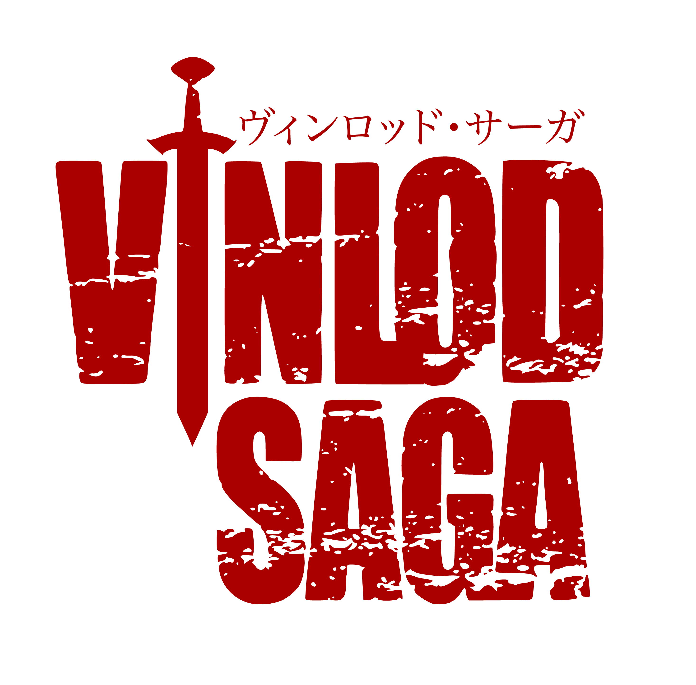

 

This project brings together ten diverse cultural heritage objects, all conceptually linked to the anime and manga Vinland Saga. Explore the cultural echoes behind these artifacts and join us on a journey through Norse legends, ancient symbols, and timeless stories brought to life through heritage.

---

## ✨ About
*VinLOD-Saga* is a digital humanities project that explores and publishes data about _Vinland Saga_ as Linked Open Data (LOD).  
The goal is to make information about characters, places, and events openly accessible and interlinked.

---

## 👥 Contributors
- [Ilaria De Dominicis](https://github.com/theair-hub)
- [Regina Manyara](https://github.com/ValkyrieCain9)
