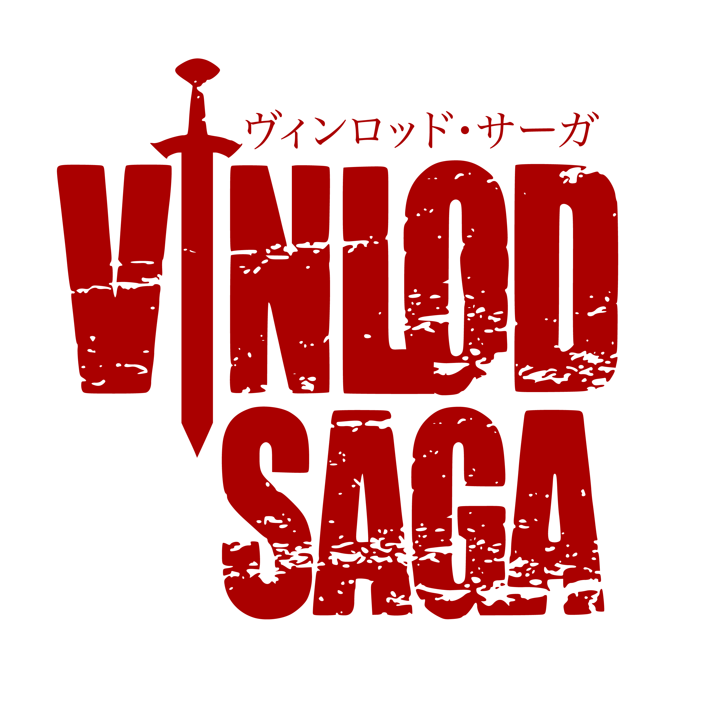

 

This project brings together ten diverse cultural heritage objects, all conceptually linked to the anime and manga Vinland Saga. Explore the cultural echoes behind these artifacts and join us on a journey through Norse legends, ancient symbols, and timeless stories brought to life through heritage.

---

## ✨ About
*VinLOD-Saga* was made for the course Information Science and Cultural Heritage (2025) with [Professor Francesca Tomasi](https://www.unibo.it/sitoweb/francesca.tomasi/en) and [Professor Marilena Daquino](https://www.unibo.it/sitoweb/marilena.daquino2/en) for the Master's degree of Digital Humanities and Digital Knowledge at the University of Bologna. 

It explores the characters, places, and events of _Vinland Saga_, connecting them to real-world cultural heritage objects, creating a linked-open dataset (LOD).
The goal is to make information about characters, places, and events openly accessible and interlinked.

---

## 👥 Contributors
- [Ilaria De Dominicis](https://github.com/theair-hub)
- [Regina Manyara](https://github.com/ValkyrieCain9)
